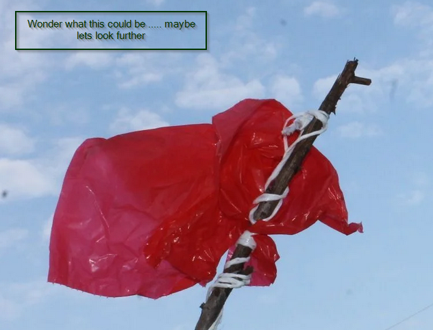

<!--This is a decoder script for the file-->
<!-- make sure you have the right dependancies and privilidges 
make sure you have python3 installed 
python3 -m pip install pillow bitarray
make a text file copy the code then after save the script below make sure to chmod and run the script with output_image.png in the same directory if the image cannot be found here go to my github docs/assets/output_image.png and download  -->

<!--
from PIL import Image
from bitarray import bitarray

def bits_to_text(bits):
    """Convert bitarray to text, handling potential decoding issues."""
    try:
        return bits.tobytes().decode('utf-8')
    except UnicodeDecodeError as e:
        print(f"Error decoding bytes: {e}")
        return bits.tobytes()  # Return raw bytes if decoding fails

def decode_message(image_path):
    """Extract the hidden message from the image."""
    img = Image.open(image_path)
    pixels = img.load()
    
    bits = bitarray()
    width, height = img.size

    for y in range(height):
        for x in range(width):
            r, g, b = pixels[x, y]
            bits.append(r & 1)
            bits.append(g & 1)
            bits.append(b & 1)

            # Check for the null byte (end of message delimiter)
            if bits[-8:] == bitarray('00000000'):
                return bits_to_text(bits[:-8])

    # If we reach here, no null byte was found; return whatever we could extract
    raw_bytes = bits_to_text(bits)
    print("No delimiter found. Raw bytes extracted:")
    print(raw_bytes)
    return raw_bytes

# Example usage
if __name__ == "__main__":
    # Replace 'output_image.png' with your image file containing the hidden message
    message = decode_message("output_image.png")
    print("Decoded message:", message)
-->

[back](./)
