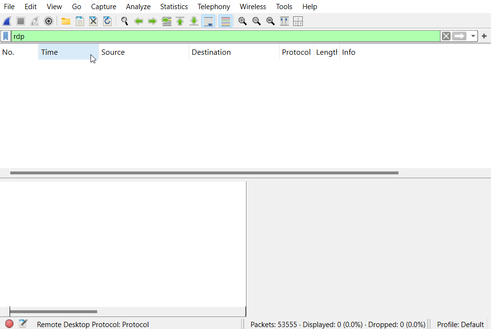
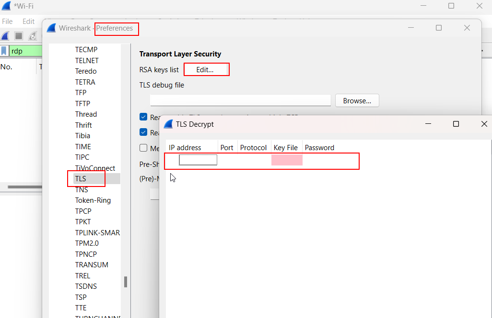
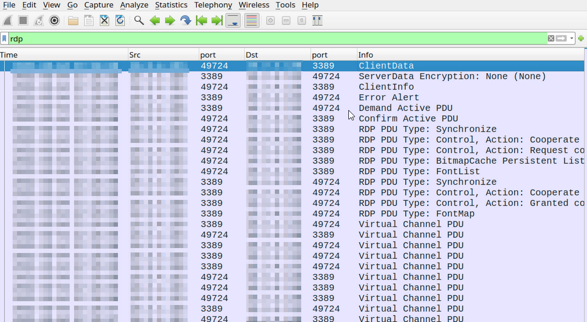

<!--Forget.html-->
## Project 2: Network Traffic Analysis with Wireshark
### Objective: The primary goal of this project was to use Wireshark for monitoring and analyzing network traffic to identify and address performance and security issues.

### Preparation: Ensured all necessary tools and prerequisites were in place, including Wireshark installation and configuration.

## Setting up wireshark 
Installation: Downloaded and installed Wireshark from the official website, ensuring the installation of necessary components like WinPcap or Npcap for packet capturing on Windows.
Wireshark download: https://www.wireshark.org/download.html

Configuration: Launched Wireshark and configured the network interfaces. This involved selecting the correct interface (Ethernet, Wi-Fi) for capturing relevant network traffic.

## Start Capturing Traffic:
    
Click on the Start button (the shark fin icon) next to the selected network interface to begin capturing packets.

Next is to start monitoring traffic to look for common weak ports using these filters 

### tcp.port == 21 for FTP traffic

Yielded no results as no devices on the network was trasferring using ftp 

### tcp.port == 80 for HTTP traffic

Yielded no results as nothing on the network was using http so i simulated it 

First made a python server 

Then ran a curl comand on another computer 

From this i cancelled the wireshark scan to analyze the packets 

Doing this shows how to find the GET request for port 80. If you are to look deeper you would find all of the files in the directory that i hosted in plain text the same would not have happened if it was being hosted with the encrypted version of http which is https

### tcp.port == 3389 for RDP traffic
Next i had to simulate this aswell to see how it shows up in wireshark.So I opened up my virtual home lab and on my server changed firewall settings and active directory to allow RDP. So then i had to run wireshark itself to record network traffic in the VLAN using promiscuous mode. While it was running i connected my 2 virtual machines with RDP and started opening/closing files and web pages.So thats when I ran into a problem....

It was ecrypted so nothing could be seen.That made me look further to see how it could be seen and through that I realized that I could use a server private key to make it visable to wireshark.

This is the steps for where to input the private key 

Now the RDP capture now shows accurately what it was scanning for and unencrypted, delving deeper you can see alot this way. This has taught me to make sure that RDP should be disabled when not used and to make sure that my private key remains that way.

[back](./)
